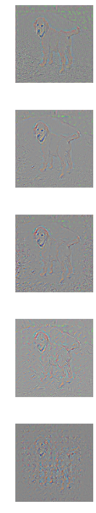

# ConvNet-Visualization

An implimentation based on the paper by Fergus and Zeiler. The architecture used is the AlexNet enhanced by deconvolutional layers. I use pretrained weights and essentially copy them into the deconvolutional layer upon initialization. The paper recommends training but this is a quicker way to illustrate the point it seems (I might be wrong though).

Exaple of the original image:

The result, what each layer "sees" from top to bottom

